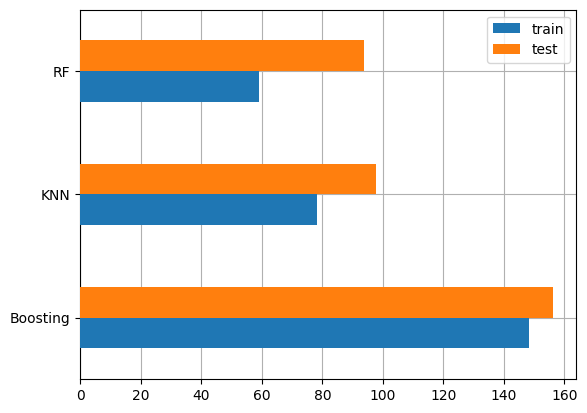
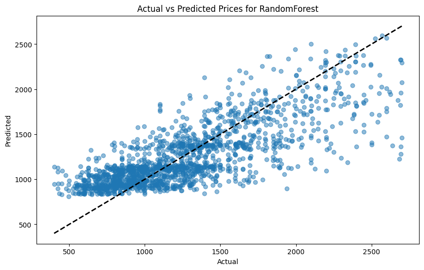

# Laporan Proyek Machine Learning - Muhammad Abiya Makruf

## Domain Proyek

**Latar Belakang**

Dalam dunia real estat dan penyewaan apartemen, menetapkan harga sewa yang akurat sangat penting baik bagi pemilik properti maupun penyewa. Penentuan harga yang tepat tidak hanya membantu pemilik properti untuk memaksimalkan pendapatan, tetapi juga membantu calon penyewa untuk menemukan tempat tinggal yang sesuai dengan anggaran mereka.

**Mengapa masalah ini harus diselesaikan?**
- Menentukan harga sewa yang tepat adalah kunci untuk menghindari kerugian baik bagi pemilik properti maupun penyewa.
- Memiliki sistem prediksi harga yang andal dapat meningkatkan efisiensi pasar penyewaan properti.

**Referensi Terkait**
- [Using machine learning algorithms for predicting real estate values in tourism centers](https://link.springer.com/article/10.1007/s00500-022-07579-7)
- [Predicting property prices with machine learning algorithms](https://www.tandfonline.com/doi/full/10.1080/09599916.2020.1832558) 

## Business Understanding

### Problem Statements
- Bagaimana cara memprediksi harga sewa apartemen berdasarkan fitur-fitur seperti jumlah kamar mandi, kamar tidur, luas apartemen, dll?
- Fitur-fitur apa yang paling berpengaruh dalam menentukan harga sewa apartemen?
- Bagaimana meningkatkan akurasi prediksi harga sewa dengan menggunakan teknik machine learning?

### Goals
- Membangun model machine learning yang dapat memprediksi harga sewa apartemen dengan akurasi tinggi.
- Mengidentifikasi fitur-fitur yang paling berpengaruh dalam menentukan harga sewa.
- Meningkatkan akurasi model prediksi melalui hyperparameter tuning dan teknik machine learning yang tepat.

### Solution statements
- Menggunakan beberapa algoritma machine learning seperti KNN, Random Forest, dan AdaBoost untuk memprediksi harga sewa.
- Membandingkan performa model dan memilih model terbaik berdasarkan metrik evaluasi seperti Mean Squared Error (MSE).

## Data Understanding
Dataset yang digunakan berasal dari [UCI Machine Learning Repository](https://archive.ics.uci.edu/dataset/555/apartment+for+rent+classified). Dataset ini berisi informasi tentang apartemen yang disewakan, termasuk fitur-fitur seperti jumlah kamar mandi, kamar tidur, luas apartemen, dan harga sewa.

Dataset memiliki jumlah  10.000 baris dan 22 kolom.

### Variabel-variabel pada dataset adalah sebagai berikut:
- id = unique identifier of apartment
- category = category of classified
- title = title text of apartment
- body = body text of apartment
- amenities = like AC, basketball,cable, gym, internet access, pool, refrigerator etc.
- bathrooms = number of bathrooms
- bedrooms = number of bedrooms
- currency = price in current
- fee = fee
- has_photo = photo of apartment
- pets_allowed = what pets are allowed dogs/cats etc.
- price = rental price of apartment
- price_display = price converted into display for reader
- price_type = price in USD
- square_feet = size of the apartment
- address =  where the apartment is located
- cityname =  where the apartment is located
- state =  where the apartment is located
- latitude = where the apartment is located
- longitude = where the apartment is located
- source = origin of classified
- time = when classified was created

**Exploratory Data Analysis (EDA)**:
- Melakukan visualisasi data untuk memahami distribusi dan hubungan antar fitur. Misalnya, menggunakan histogram untuk melihat distribusi harga, jumlah kamar tidur, dan luas apartemen.

## Data Preparation
**Teknik Data Preparation**
- Handling Missing Values: Mengimputasi atau menghapus nilai yang hilang pada dataset.
- Removing Outliers: Menghapus data yang memiliki nilai outliers pada kolom tertentu.
- Drop fitur yang tidak memberikan nilai tambahan.
- Encoding Categorical Variables: Mengubah variabel kategorikal menjadi variabel numerik menggunakan teknik one-hot encoding.
- Pembagian dataset.
- Feature Scaling: Melakukan normalisasi atau standarisasi pada fitur numerik untuk memastikan semua fitur berada dalam skala yang sama.

**Alasan Data Preparation**
- Mengatasi missing values untuk menghindari masalah saat training model.
- Encoding categorical variables untuk memungkinkan model machine learning memproses data.
- Feature scaling untuk memastikan model tidak bias terhadap fitur dengan skala besar.
- Removing outliers untuk meningkatkan akurasi model dengan menghilangkan data yang dapat mempengaruhi performa model.

## Modeling

**Algoritma yang Digunakan**
1. K-Nearest Neighbors (KNN)
    * Kelebihan: Sederhana dan mudah diimplementasikan.
    * Kekurangan: Tidak skala dengan baik untuk dataset besar.
2. Random Forest
    * Kelebihan: Dapat menangani data yang kompleks dan memiliki kemampuan generalisasi yang baik.
    * Kekurangan: Dapat menjadi lambat dan memori intensif untuk dataset besar.
3. AdaBoost
    * Kelebihan: Dapat meningkatkan performa model sederhana dengan menggabungkan beberapa model.
    * Kekurangan: Rentan terhadap outliers dan noise dalam data.

**Hyperparameter Tuning** 
Menggunakan GridSearchCV untuk mencari parameter terbaik bagi masing-masing model, seperti jumlah tetangga untuk KNN, jumlah pohon dan kedalaman maksimum untuk Random Forest, dan learning rate untuk AdaBoost.

**Pemilihan Model Terbaik**
Memilih model dengan performa terbaik berdasarkan nilai Mean Squared Error (MSE) pada data uji. Model yang memiliki MSE terendah akan dipilih sebagai model terbaik.

## Evaluation

**Metrik Evaluasi**
- Mean Squared Error (MSE): Mengukur rata-rata kuadrat dari kesalahan prediksi. MSE yang lebih rendah menunjukkan performa model yang lebih baik.

**Penjelasan Metrik**

Mean Squared Error (MSE) adalah metrik umum yang digunakan untuk mengevaluasi akurasi model regresi. MSE didefinisikan sebagai berikut:

$$
\text{MSE} = \frac{1}{n} \sum_{i=1}^{n} (y_i - \hat{y}_i)^2
$$

di mana:
- \( y_i \) adalah nilai aktual,
- \( \hat{y}_i \) adalah nilai prediksi,
- \( n \) adalah jumlah sampel.

MSE memberikan penalti yang lebih besar untuk kesalahan yang lebih besar karena penggunaan kuadrat kesalahan. Nilai MSE yang lebih rendah menunjukkan performa model yang lebih baik.

**Hasil Proyek**

| | train | test |
|----------|----------|----------|
| KNN | 78.099856 | 97.804678 |
| RF | 59.18405	| 93.696278 | 
| Boosting | 148.285221	| 156.19596 |
	

- KNN: Setelah melakukan hyperparameter tuning, model KNN memiliki nilai MSE 78.099856.
- Random Forest: Model Random Forest menunjukkan performa yang lebih baik dibandingkan KNN dengan MSE yang lebih rendah yaitu 59.18405.
- AdaBoost: Model AdaBoost juga menunjukkan performa yang kompetitif dengan nilai MSE 148.285221.

Model Terbaik: Berdasarkan hasil evaluasi, model Random Forest dipilih sebagai model terbaik karena memiliki MSE terendah pada data uji.

